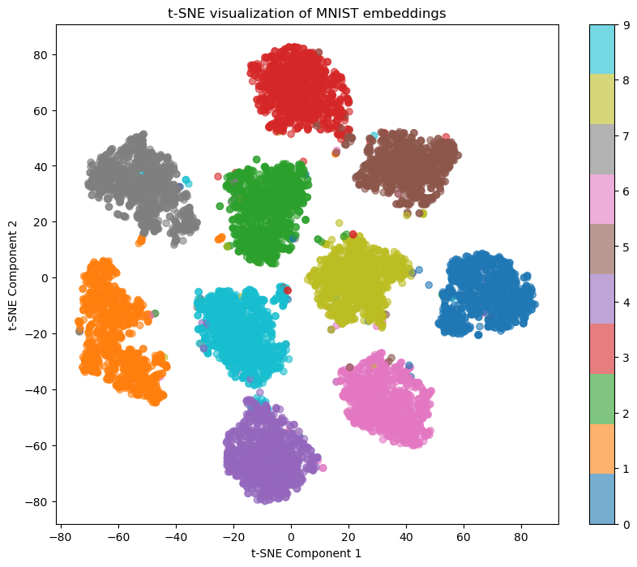

# Metric Learning on MNIST with Triplet Loss

This project demonstrates metric learning on the MNIST dataset using triplet loss. The goal is to train a model to differentiate between similar and dissimilar pairs of data points. 
The triplet consists of an anchor, a positive example (similar to the anchor), and a negative example (dissimilar to the anchor).

## Project Structure

- `MetricLearningMNIST.ipynb`: Jupyter notebook containing the implementation of the model and training process using triplet loss.

## Requirements

- Python 3.7 or higher
- PyTorch
- torchvision
- scikit-learn
- matplotlib

## Installation

1. Clone the repository:
   ```sh
   git clone https://github.com/Vlhermitte/DeepMetricLearning.git
   cd DeepMetricLearning
   ```
   
2. Install the required packages:
    ```
   pip install torch torchvision scikit-learn matplotlib
   ```
   
3. Run the Jupyter notebook:
   ```
    jupyter notebook MetricLearningMNIST.ipynb
    ```
   
## Explanation

### Data Preparation

- The MNIST dataset is loaded and transformed. 
- A custom TripletMNIST dataset class is created to generate triplets (anchor, positive, negative).

### Model Architecture

- A simple convolutional neural network (CNN) is used as the model.

### Triplet Loss

- The triplet loss is defined as the maximum of the distance between the anchor and the positive example and the distance between the anchor and the negative example.

```math
    L(a, p, n) = max(d(a, p) - d(a, n) + margin, 0)
```
where `d(a, p)` is the distance between the anchor and the positive example, 
`d(a, n)` is the distance between the anchor and the negative example, and `margin` is a hyperparameter.

### Training

- The model is trained for a specified number of epochs, with the triplet loss being computed and backpropagation in each iteration.

### Clustering Visualization

- The trained model is used to generate embeddings for the MNIST dataset.
- t-SNE is used to visualize the embeddings in 2D space.
- The reduced 2D embeddings are plotted using matplotlib, with different colors representing different digit classes.

## Results

The t-SNE visualization will produce a scatter plot showing the clustering of digit embeddings. 
The colors represent different digit labels, allowing you to see how well the model has learned to cluster similar digits together.




## References

- [Computer Vision Methods Lecture on Deep Metric Learning at CVUT](http://ptak.felk.cvut.cz/personal/toliageo/share/mpv/2024/mpv24_deepmetriclearning.pdf)
